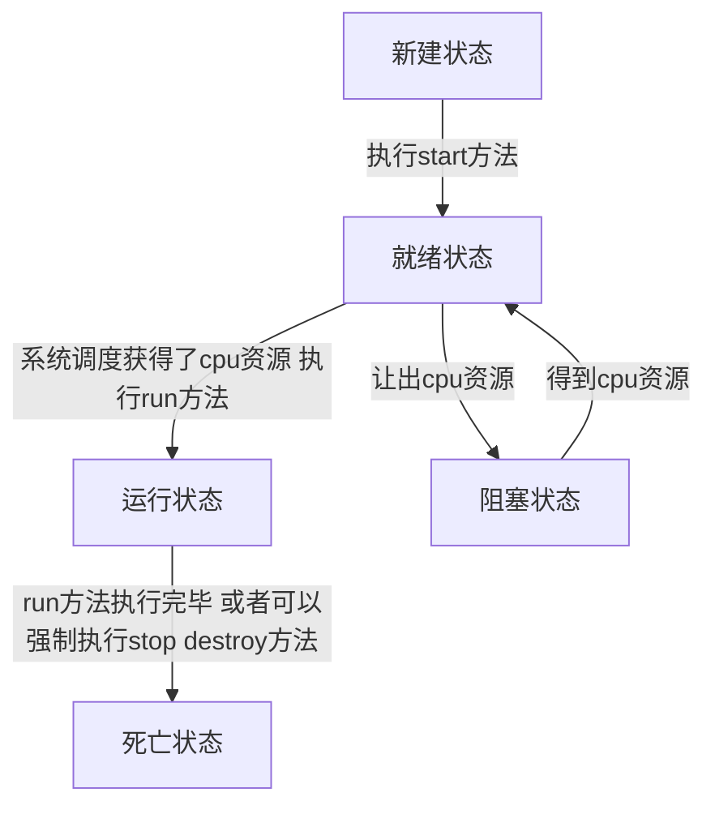

# JAVA多线程

## 多线程概述：

​     **操作系统中会有进程的概念，一个进程里面会有多个线程的概念，如果是单核CUP那么CUP会按照并发处理，一个线程等待立马切换到另一个线程去执行，给人一种同时执行的感觉。所以多线程就是一个进程下面的多个任务就被成为多线程。多线程可以提高工作效率**

​    



{%asset_img someline.jpg 多线程状态流程图}

- 新建状态: （资料来源于菜鸟教程）

  使用 **new** 关键字和 **Thread** 类或其子类建立一个线程对象后，该线程对象就处于新建状态。它保持这个状态直到程序 **start()** 这个线程。

- 就绪状态:

  当线程对象调用了start()方法之后，该线程就进入就绪状态。就绪状态的线程处于就绪队列中，要等待JVM里线程调度器的调度。

- 运行状态:

  如果就绪状态的线程获取 CPU 资源，就可以执行 **run()**，此时线程便处于运行状态。处于运行状态的线程最为复杂，它可以变为阻塞状态、就绪状态和死亡状态。

- 阻塞状态:

  如果一个线程执行了sleep（睡眠）、suspend（挂起）等方法，失去所占用资源之后，该线程就从运行状态进入阻塞状态。在睡眠时间已到或获得设备资源后可以重新进入就绪状态。可以分为三种：

  - 等待阻塞：运行状态中的线程执行 wait() 方法，使线程进入到等待阻塞状态。
  - 同步阻塞：线程在获取 synchronized 同步锁失败(因为同步锁被其他线程占用)。
  - 其他阻塞：通过调用线程的 sleep() 或 join() 发出了 I/O 请求时，线程就会进入到阻塞状态。当sleep() 状态超时，join() 等待线程终止或超时，或者 I/O 处理完毕，线程重新转入就绪状态。

- 死亡状态:

  一个运行状态的线程完成任务或者其他终止条件发生时，该线程就切换到终止状态。

---

## java中创建多线程的两种方式

+ 使用Runnable接口实现来新建一个线程

```java
/**
 * @author 小希希
 * 使用Runnable接口新建一个线程
 * 1.创建一个类(Thread)实现Runnable接口
 * 2.重写run方法
 * 3.将该类以参数形式传递给Thread对象
 * 4.调用start方法
 */
public class Thread02 implements Runnable {
	@Override
	public void run() {
	System.out.println(Thread.currentThread().getName());	
	}
}
class Test02{
	public static void main(String[] args) {
		Thread thread1 = new Thread(new Thread02());
		thread1.start();
		Thread thread2 = new Thread(new Thread02());
		thread2.start();
		Thread thread3 = new Thread(new Thread02());
		thread3.start();
		Thread thread4 = new Thread(new Thread02());
		thread4.start();
	}
}
```





+ 使用继承Thread类新建一个线程

```java
/**
 * @author 小希希
 * 使用继承Thread来新建一个线程
 * 1.创建一个类并继承Thread类
 * 2.重写run方法
 * 3.创建该类对象并调用start方法就相当于开启了一个线程
 * 缺点：继承只能单继承所以不灵活
 */
public class Thread03 extends Thread {
	@Override
	public void run() {
      System.out.println(this.currentThread().getName());
	}
}
class Test03{
	public static void main(String[] args) {
		Thread03 thread1 =new Thread03();
		thread1.start();
		Thread03 thread2 =new Thread03();
		thread2.start();
		Thread03 thread3 =new Thread03();
		thread3.start();
		Thread03 thread4 =new Thread03();
		thread4.start();
		for (int i = 0; i < 4; i++) {
			System.out.println(Thread.currentThread().getName() +"-"+i);
			
		}
	}
}
```





+ sss

```java
/** 
 * @author Admin
 *通过 Callable 和 Future 创建线程
 *1.实现Callable接口
 *2.重写call方法
 *3.创建实现类对象
 *4.创建FutureTask对象并将实现类对象传递给其
 *5.创建Thread对象将FutureTask(为Runnable)对象传递进去
 *6.调用start方法创建一个新的线程JVM会去调用call方法
 *缺点：太过于复杂不如使用实现Runnable接口
 */
public class Thread04 implements Callable<Integer> {

	@Override
	public Integer call() throws Exception {
		int i = 0;
		for (; i < 20; i++) {
			System.out.println(Thread.currentThread().getName()+" "+i);
		}
		return i;
	}
	
	public static void main(String[] args) {
		Thread04 thread1 = new Thread04();
		FutureTask<Integer> ft = new FutureTask<Integer>(thread1);
		 for(int i = 0;i < 50;i++)  
	        {  
	            System.out.println(Thread.currentThread().getName()+" 的循环变量i的值"+i);  
	            if(i==20)  
	            {  
	                new Thread(ft,"有返回值的线程").start();  
	            }  
	        }   
	            try {
					System.out.println("子线程的返回值："+ft.get());
				} catch (InterruptedException e) {
					e.printStackTrace();
				} catch (ExecutionException e) {
					e.printStackTrace();
				}  
	
	}

}

```

